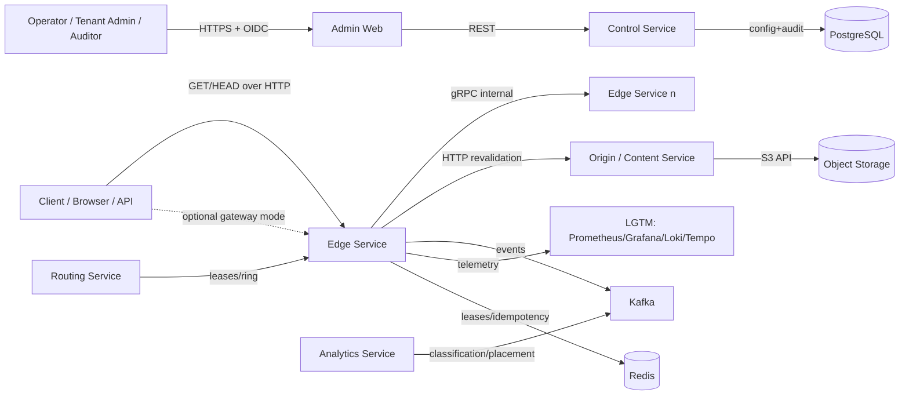
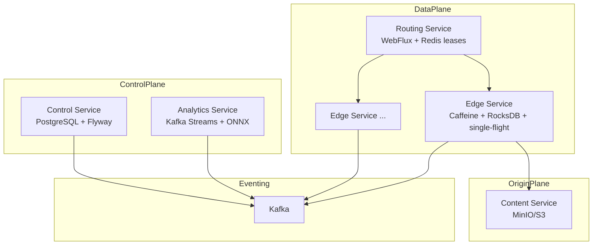
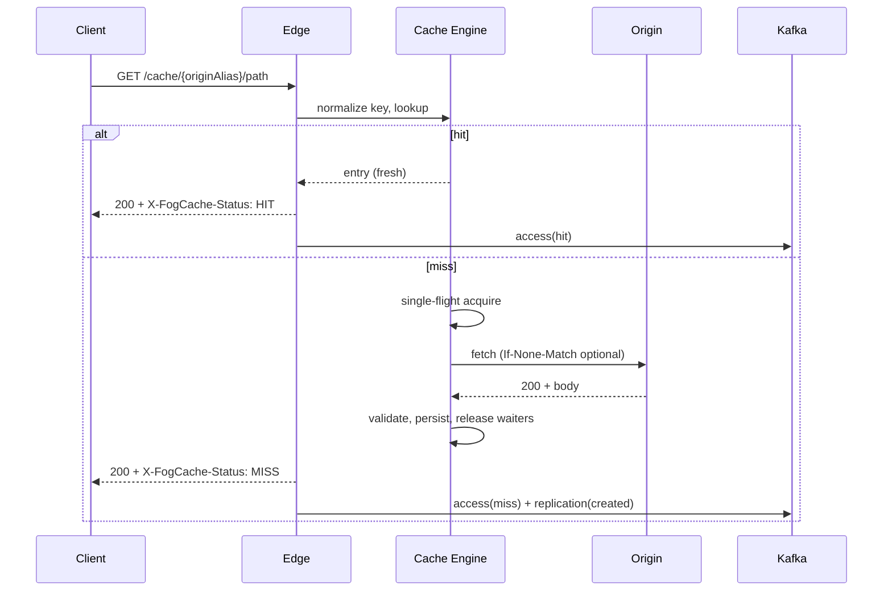
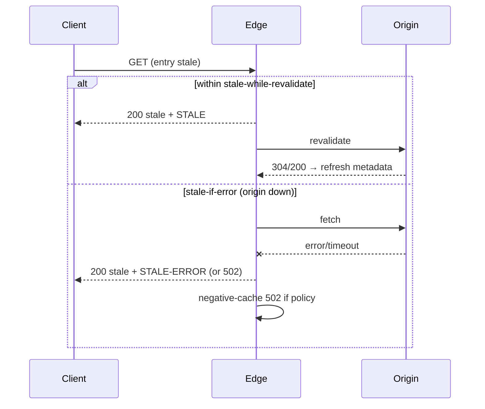
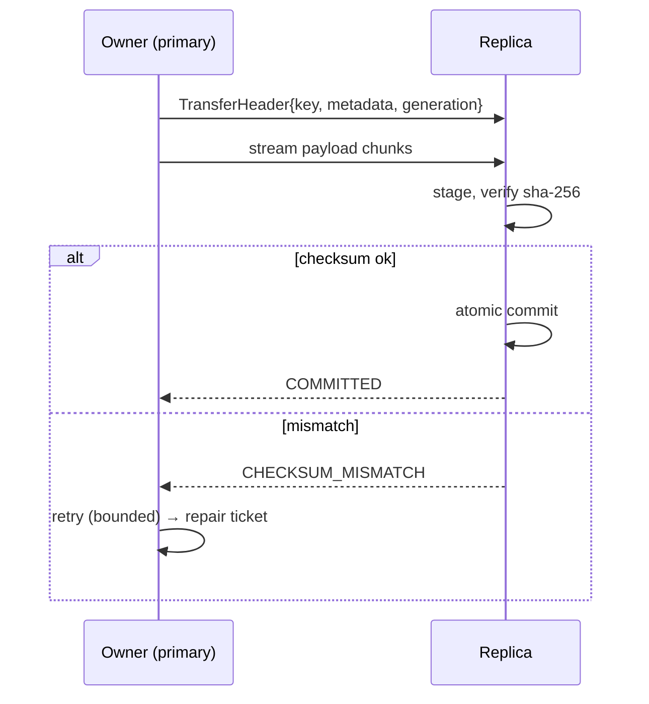
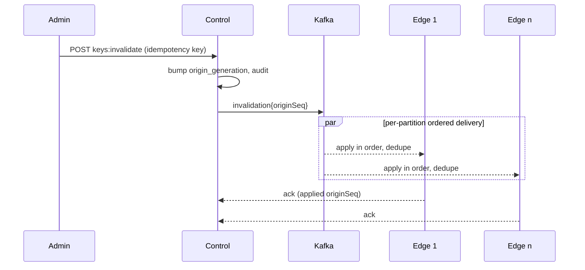
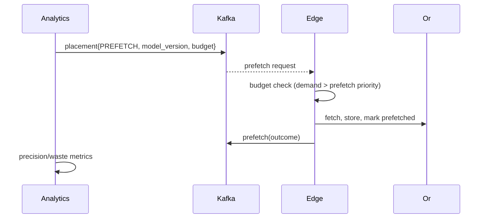
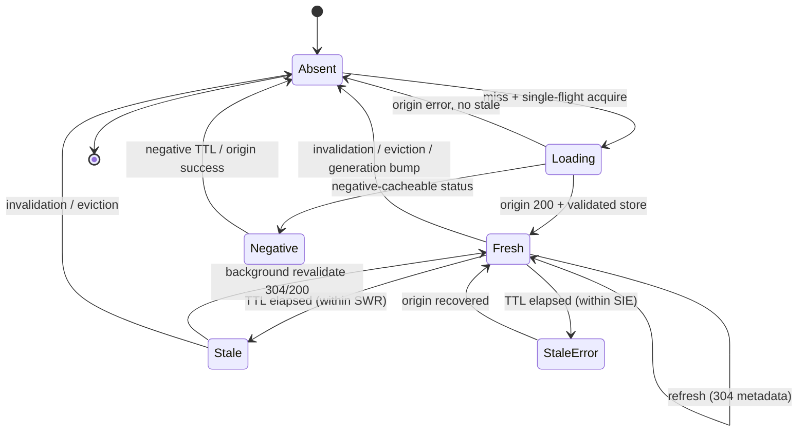
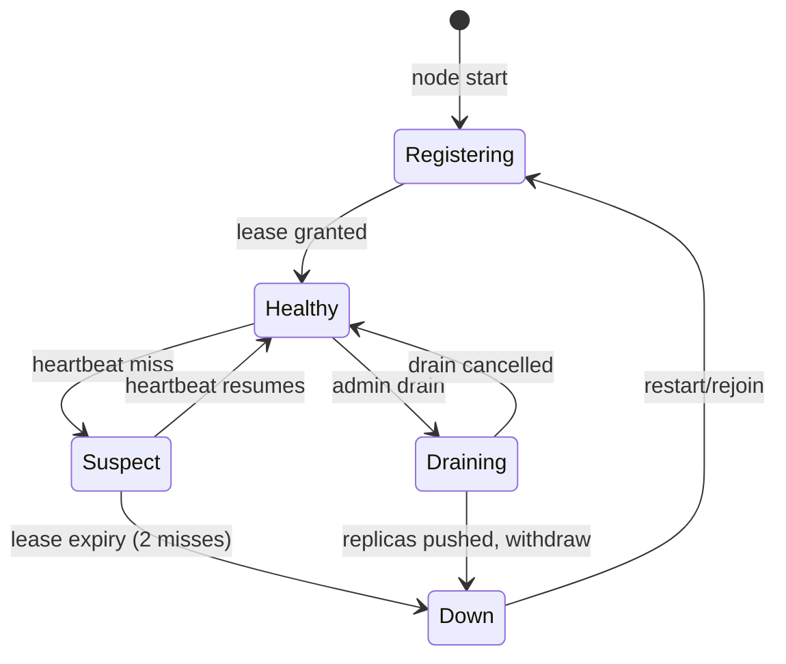

# FogCache — Architecture Diagrams (00.10)

Status: Agreed · Version: 1 · Issue: VED-59
All diagrams are Mermaid source; they match `docs/technical-design.md`, the contracts, and the acceptance journeys (J-01…J-12). Versioning convention: diagrams change only with the corresponding design/contract change (see `contract-conventions.md` §1 and `risk-register.md`).

## 1. Context diagram



## 2. Container diagram (simplified)



## 3. Sequence: normal hit and miss



## 4. Sequence: stale-while-revalidate and stale-if-error



## 5. Sequence: replication (transfer commit)



## 6. Sequence: invalidation propagation



## 7. Sequence: node failure and failover

```mermaid
sequenceDiagram
    participant E2 as Edge n2 (owner)
    participant RT as Routing
    participant E3 as Edge n3 (replica)
    E2--x RT: lease expires (2 missed heartbeats)
    RT->>RT: topology bump (version v2)
    RT->>E3: promote owner
    E3->>E3: serve replica or fetch from origin
    Note over E3: remap ≤ 20% of keys; alert edge-node-down
```

## 8. Sequence: prefetch



## 9. State diagram: cache entry lifecycle



## 10. State diagram: node membership


